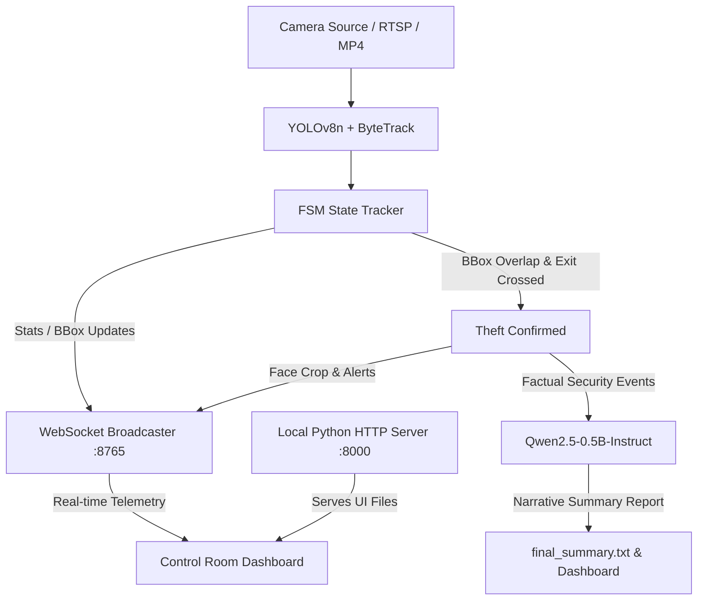

# Smart AI-Powered Lab Surveillance & Theft Detection System

An AI-driven real-time video surveillance system that combines **YOLOv8** object detection, **ByteTrack/Deep OC-SORT** tracking, and a local **Qwen2.5-0.5B-Instruct LLM** to detect laboratory asset theft. It features a responsive web dashboard with a live camera feed telemetry display, dynamic entry/exit door zone mapping, and real-time WebSocket communications.

---

## 1. Folder Structure

```text
5G/
├── best.pt                            # Main trained YOLOv8 model weights
├── surv.py                            # Core surveillance script (runs tracking, LLM, HTTP/WS servers, and git sync)
├── theft.mp4                          # Sample video containing lab theft scenarios
├── video.mp4                          # Sample video containing normal lab movements
│
├── dashboard/                         # Web Control Room Dashboard Frontend & Broker
│   ├── index.html                     # Control room dashboard page (TailwindCSS)
│   ├── dashboard.js                   # WebSocket handler, charts, & data visualizer
│   ├── styles.css                     # Custom styles, responsive grid, & warning glows
│   ├── server.js                      # Node.js WebSocket relay broker
│   ├── package.json                   # Node package config for WebSocket broker dependencies
│   ├── session.json                   # Live telemetry update file
│   └── README.md                      # Dashboard readme file
│
├── trackers/                          # Object Tracking Configs
│   ├── bytetracker.yaml               # ByteTrack tracker configuration thresholds
│   └── deepocsort.yaml                # Deep OC-SORT tracker configuration parameters
│
├── weights/                           # Backup/Alternative Weights Folder
│   ├── best.pt                        # Backup copy of trained model weights
│   └── yolov8m.pt                     # YOLOv8 medium model weights (optional)
│
└── ultralytics-20260605T103000Z-3-001/ # Vendored Ultralytics YOLOv8 library dependency
    └── ultralytics/                   # Source files for detection and tracking APIs
```

---

## 2. Conda Environment Setup

Follow these steps to check, create, and configure the Conda environment required to run the surveillance scripts.

### Check if Conda is Installed
Open your terminal and run:
```bash
conda --version
```
If Conda is not found, download and install [Miniconda](https://docs.conda.io/en/latest/miniconda.html) or [Anaconda](https://www.anaconda.com/).

### Check if Environment Already Exists
Check your existing environments:
```bash
conda env list
```
*If an environment named `surv_env` is already present, you can activate it directly.*

### Create and Activate Environment
If the environment is not found, create a new python 3.10 environment:
```bash
conda create -n surv_env python=3.10 -y
conda activate surv_env
```

---

## 3. Required Library Installation

With the `surv_env` active, run the following commands to install the required system and Python dependencies:

### PyTorch (with GPU / CUDA acceleration support)
*   **For GPU CUDA (Highly Recommended for real-time performance)**:
    Determine your system's CUDA version, then install the matching PyTorch version:
    ```bash
    conda install pytorch torchvision torchaudio pytorch-cuda=11.8 -c pytorch -c nvidia -y
    # OR using pip:
    pip install torch torchvision torchaudio --index-url https://download.pytorch.org/whl/cu118
    ```
*   **For CPU-only (Testing/Laptops)**:
    ```bash
    conda install pytorch torchvision torchaudio cpuonly -c pytorch -y
    ```

### Python Dependencies
Install the remaining packages via `pip`:
```bash
pip install opencv-python psutil websockets pillow transformers accelerate numpy
```

> [!NOTE]
> The **Ultralytics YOLOv8** package is already vendored in the project folder under `ultralytics-20260605T103000Z-3-001`. You do **not** need to install it globally.

---

## 4. Multi-PC Portability & Directory Changes

The code uses dynamic path resolution based on the script's location via `ROOT = Path(__file__).resolve().parents[0]`. This allows you to copy/paste the project directory onto any new machine without editing directory paths.

However, check the following config changes when deploying to a new PC:

1.  **Video Stream Source (`--source` Parameter)**:
    By default, the script points to an RTSP camera stream IP. If running on another machine or network, run with a local video file or webcam override:
    ```bash
    python3 surv.py --source video.mp4     # Uses test video
    python3 surv.py --source 0             # Uses local webcam (index 0)
    ```
2.  **Git Auto-Deploy Configuration**:
    Around line 700 & 1365 of `surv.py`, the script attempts to push changes to `https://github.com/PremSagar888/Smart-survvilance.git` using a hardcoded Personal Access Token (PAT).
    *   *If you do not want it auto-pushing files to GitHub, comment out the `subprocess.run(["git", ...])` blocks.*
3.  **Tracker Bounding Box Resolution**:
    In `surv.py`, the tracker is set to `"bytetrack.yaml"`. If the tracker file is not automatically resolved by the YOLO wrapper on the new machine, update the `run()` arguments or model call to:
    ```python
    tracker=str(ROOT / "trackers" / "bytetracker.yaml")
    ```
4.  **HuggingFace Cache Directory**:
    HuggingFace models are cached under the user's home folder `Path.home() / ".cache" / "huggingface"`. This resolves automatically on Windows, Linux, and macOS.

---

## 5. System Architecture & How it Works



### Object Tracking & Weights
*   The script initializes the custom trained YOLOv8n model weights `best.pt`.
*   During processing, the frames are analyzed for `person` and target assets (`laptop`, `monitor`, `keyboard`, `mouse`).
*   **ByteTrack** maps persistent track IDs to detected objects across frames, preventing ID-switching during occlusion.

### Theft Detection logic (State Machine)
*   **Overlap Verification**: If the center of an asset bounding box sits inside a person's bounding box for at least 8 frames (`CARRY_CONFIRM_FRAMES`), the FSM flags the person as *carrying* that specific asset.
*   **Door zone crossing**: If the carrying person approaches a detected door zone and exits the camera view (`STATE_LEFT`), the script confirms a theft, saves the suspect crop under `/outputs_intern/tracking_results/results_<N>/suspects/`, and broadcasts a critical threat update.

### Web Server, WebSockets, & IP Binding
*   **Local Web Server**: The Python backend spins up a background HTTP server on port `8000` to serve the static frontend code in `dashboard/`.
*   **WebSocket Telemetry**: A background WebSocket server runs on port `8765` to broadcast live frame telemetry, bounding box events, ID database images, and suspect profiles to the dashboard browser client.
*   **LAN IP Auto-Detection**: The script automatically fetches the host PC's local network IP using `socket`. It opens the default browser with the query parameter `?ip=<LAN_IP>`, allowing other devices on the same Wi-Fi network (like tablets or phones) to easily connect and render the live stats.
